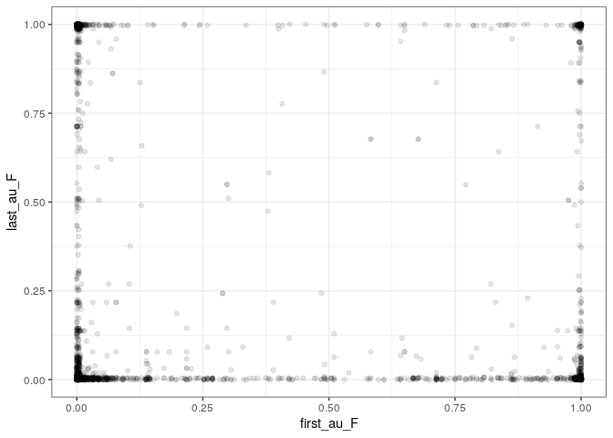
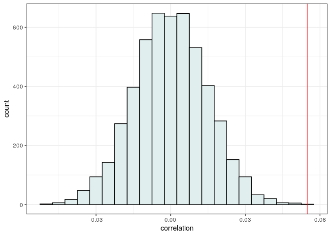
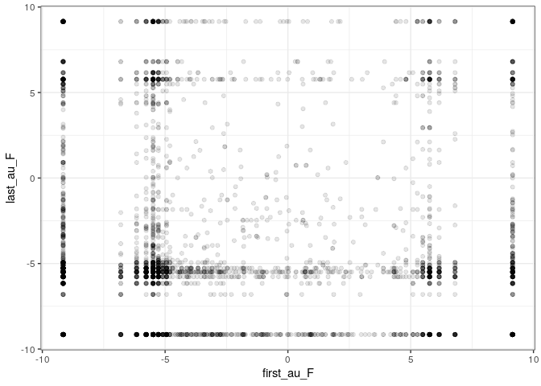
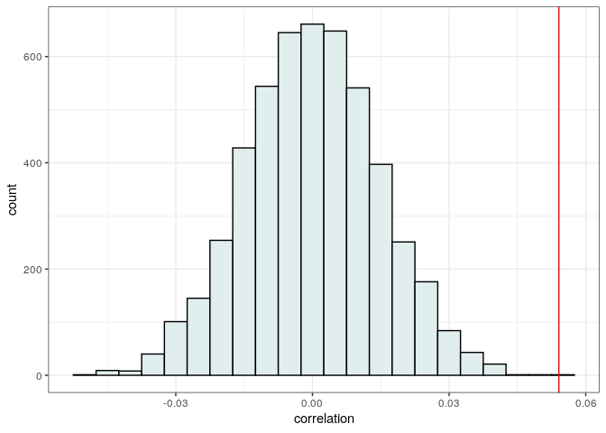
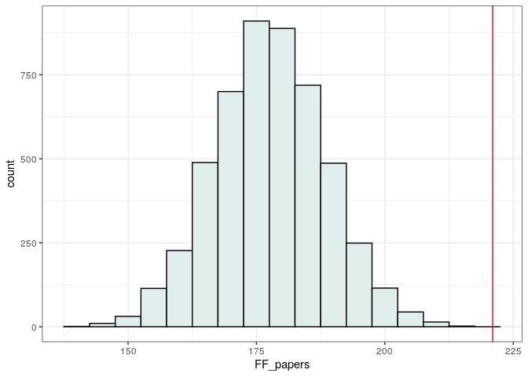

Example: Homophily in authorship
================
**Stefano Allesina**
QuEST Workshop, U. Vermont, Apr 2021

# Introduction

We want to test whether authors are more likely to collaborate with
other authors of the same sex. To test this idea, we use the probability
that the first (last) author was assigned a certain sex at birth,
computed as the frequency of a certain name/sex combination in the data
from the Social Security Administration.

# Data

We take all the articles for which we have an estimate of the
probability that the first author and the last author are female.
Importantly, we exclude papers with only a single author, as in those
cases the first and last authors are the same person\!

``` r
library(tidyverse)
dt <- read_csv("../data/plos_compbio.csv")
# filter data
dt2 <- dt %>% 
  filter(document_type == "Article") %>% 
  filter(!is.na(first_au_F), !is.na(last_au_F)) %>% 
  filter(!is.na(num_authors)) %>% filter(num_authors > 1)
```

As you can see, the data contain various combinations (including the
“corners” M/M, M/F, F/M, F/F):

``` r
pl1 <- ggplot(dt2) + 
  aes(x = first_au_F, y = last_au_F) + 
  geom_point(alpha = 0.1) + 
  theme_bw()
show(pl1)
```



Note also that we have more density close to (0, 0), (0, x) and (x, 0),
consistently with the fact that the number of women first/last authors
has been increasing, but is still below that of men.

## Strategy 1: correlation + randomization

We compute the correlation between `first_au_F` and `last_au_F`, then
repeatedly randomize the data and check whether the observed correlation
is higher than
expected:

``` r
compute_corr_authors <- function(x) return(cor(x$first_au_F, x$last_au_F))
observed <- compute_corr_authors(dt2)
num_randomizations <- 5000
randomized <- sapply(1:num_randomizations, function(x) {
  tmp <- dt2 %>% mutate(first_au_F = sample(first_au_F)) 
  return(compute_corr_authors(tmp))
  })
```

Now plot and compute a
p-value

``` r
pl2 <- ggplot(data = tibble(correlation = randomized)) + aes(x = correlation) + 
  geom_histogram(binwidth = 0.005, fill = "azure2", colour = "black") + 
  geom_vline(xintercept = observed, colour = "red") + 
  theme_bw()
show(pl2)
```



``` r
print("p(observed <= randomized)")
print(sum(observed <= randomized) / length(randomized))
```

    # [1] "p(observed <= randomized)"
    # [1] 2e-04

Showing that the correlation is positive, and higher than what expected.

## Strategy 2: correlation + randomization on transformed data

Proportions/probabilities are a bit tricky to work with—typically we
want to transform the data prior to computing a correlation. A commonly
employed strategy is to analyze the log-odds-ratio (as in the logistic
regression)—which however requires not to have “pure” zeros or ones in
the data set. We can “compress” the data using the approach by Smithson
and Verkuilen’s\[1\] and then log-transform the odds ratios:

``` r
compress_01 <- function(x){
   # Smithson and Verkuilen's (2006) formula 
   return((x * (length(x) - 1) + 0.5) / length(x))
}

logit_transform <- function(x){
  # transform proportions x' = log(x/(1-x))
  return(log(x / (1 - x)))
}

dt3 <- dt2 %>% mutate(first_au_F = logit_transform(compress_01(first_au_F)),
                      last_au_F = logit_transform(compress_01(last_au_F)))
pl1t <- ggplot(dt3) + 
  aes(x = first_au_F, y = last_au_F) + 
  geom_point(alpha = 0.1) + 
  theme_bw()
show(pl1t)
```



Repeating the procedure, we find the same qualitative
result:

``` r
compute_corr_authors <- function(x) return(cor(x$first_au_F, x$last_au_F))
observed <- compute_corr_authors(dt3)
num_randomizations <- 5000
randomized <- sapply(1:num_randomizations, function(x) {
  tmp <- dt3 %>% mutate(first_au_F = sample(first_au_F)) 
  return(compute_corr_authors(tmp))
  })
```

Now plot and compute a
p-value

``` r
pl3 <- ggplot(data = tibble(correlation = randomized)) + aes(x = correlation) + 
  geom_histogram(binwidth = 0.005, fill = "azure2", colour = "black") + 
  geom_vline(xintercept = observed, colour = "red") + 
  theme_bw()
show(pl3)
```



``` r
print("p(observed <= randomized)")
print(sum(observed <= randomized) / length(randomized))
```

    # [1] "p(observed <= randomized)"
    # [1] 0

## Strategy 3: hard assignment + randomization

Alternatively, we can assign `F` to authors with `first_au_F` larger
than an arbitrary cutoff (here, 0.95), and count the number of pairs
`F/F` in the observed and randomized
data:

``` r
dt2 <- dt2 %>% mutate(first_gender = ifelse(first_au_F > 0.95, "F", "M/U"),
                      last_gender = ifelse(last_au_F > 0.95, "F", "M/U"))
count_FF <- function(tmp) {
  return(nrow(tmp %>% filter(first_gender == "F", last_gender == "F")))
}
observed <- count_FF(dt2)
num_randomizations <- 5000
randomized <- sapply(1:num_randomizations, function(x) {
  tmp <- dt2 %>% mutate(first_gender = sample(first_gender)) 
  return(count_FF(tmp))
  })
```

Again, we find the same qualitative
result:

``` r
pl4 <- ggplot(data = tibble(FF_papers = randomized)) + aes(x = FF_papers) + 
  geom_histogram(binwidth = 5, fill = "azure2", colour = "black") + 
  geom_vline(xintercept = observed, colour = "red") + 
  theme_bw()
show(pl4)
```



``` r
print("p(observed <= randomized)")
print(sum(observed <= randomized) / length(randomized))
```

    # [1] "p(observed <= randomized)"
    # [1] 0

# Conclusions

Authors tend to co-author papers with authors of the same sex more often
than what expected by chance. Previous studies have found that homophily
extends well beyond sex\[2\].

1.  *A better lemon squeezer? Maximum-likelihood regression with
    beta-distributed dependent variables*, Psychol Methods. 2006

2.  Gallivan & Ahuja (2015) *Co-authorship, homophily, and scholarly
    influence in information systems research*. Journal of the
    Association for Information Systems; Ghiasi et al. (2018) *Gender
    homophily in citations.* 3rd International Conference on Science and
    Technology Indicators; Wang et al. *Gender-based homophily in
    collaborations across a heterogeneous scholarly landscape.* arXiv
