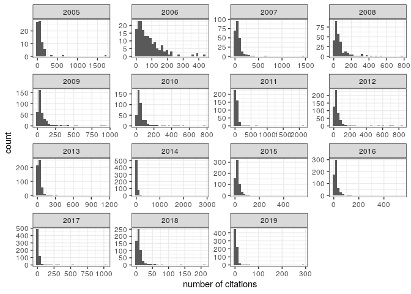

A Skeptic’s Guide to Scientific Writing
================
**Stefano Allesina**
QuEST Workshop, U. Vermont, Apr 2021

# History of the paper

# Common advice on writing papers

# What works for me

# Pet peeves and best practices

Things that I value as a **reviewer**:

  - line numbers, please\!
  - no poetic/enigmatic titles
  - if you are using data, include them
  - if you are using code, include it (and make it
    [readable](https://github.com/StefanoAllesina/R3CR/tree/master/lecture_1))
  - if you are using interesting/novel techniques, be pedagogical
  - cite relevant work
  - put care in preparing figure/text

Things that I value as an **editor**:

  - clearly state the problem you want to solve
  - it is better if the problem existed before you solved it
  - make a clear case for the choice of journal
  - do not overstate relevance/novelty
  - include suggestions for handling/academic editors and reviewers

# Being a skeptic

# Have some fun with real data

The file `data/plos_compbio.csv` contains data on all the documents
published in PLoS Computational Biology (as of 3/3/2021). The file is
comma-separated, with headers specifying the content of each column:

  - `DOI` the Digital Object Identifier for the document
  - `title` the title of the document
  - `year` the publication year
  - `num_citations` number of citations received (Scopus data)
  - `num_views` number of views for the html version of the document
  - `document_type` type of document (see below)
  - `num_authors` number of authors
  - `num_references` number of references cited in the document
  - `num_figures` number of figures in the document
  - `num_equations` obtained counting special math formatting in XML
    source of the document
  - `num_countries` number of distinct countries in affiliation list
  - `num_words_title` number of words in the title
  - `num_words_abstract` number of words in the abstract
  - `prop_words_abs` proportion of distinct words in the abstract that
    are found in a list of words used for spell-checking (~0.5M words)
  - `prop_simple_words_abs` proportion of distinct words in the abstract
    that are found in a list of words used in simplified English (~2K
    words)
  - `first_au_F` probability that first author is a woman (see below)
  - `last_au_F` probability that last (senior) author is a woman (see
    below)

The file `data/plos_compbio_details.csv` contains:

  - `DOI` the Digital Object Identifier for the document
  - `abstract` the full text of the abstract (for documents with an
    abstract)
  - `countries` the list of countries represented in the affiliation
    list
  - `subjects` a list of (self-reported) subjects
  - `reference_years` the years in which the cited references were cited

## Notes on data

Obligatory disclaimer: data are never perfect.

Missing data (e.g., for documents without abstract) is reported as `NA`.

You can read a document by opening
`https://journals.plos.org/ploscompbiol/article?id=YOUR_DOI_HERE` for
example
<https://journals.plos.org/ploscompbiol/article?id=10.1371/journal.pcbi.1000494>

Types of documents

  - Article: 7173
  - Editorial: 155
  - Erratum: 150
  - Review: 149
  - Short Survey: 15
  - Letter: 14
  - Note: 13
  - Conference Paper: 6

Assignment of gender is based on first name. The reported probability is
computed by counting the number of newborns that were assigned at birth
a certain name and sex combination (as of today, SSA reports only
male/female). The data, provided by the Social Security Administration,
covers US newborns from about 1880 to today. Clearly, the assignment is
going to be most accurate for authors residing in English-speaking
countries, though the large immigrant population in the US allows some
resolution of names that originated in other areas of the world.

## Taking a peek

This rich data set allows us to explore several aspects of scientific
writing. Just a few basic visualizations:

``` r
# the code for the visualizations below is here
source("../data_viz/simple_visualizations.R")
```

Distribution of
citations:

``` r
pl_cit1
```



Note the very broad, skewed distribution. To model citations, is
therefore convenient to transform the data. In particular, plotting
`log(num_citations + 1)`, we
obtain:

``` r
pl_cit2
```


Note the many documents with zero citations—these are mostly editorials,
errata, etc. Considering only `Article`, we find Gaussian-looking
distributions (note that 2020 and 2021 are
excluded):

``` r
pl_cit3
```


Similarly, the number of views is highly
skewed:

``` r
pl_view1
```


and the transformation has a similar
effect

``` r
pl_view3
```


The typical number of authors per document increased slightly over the
years:

``` r
pl_au
```


And the proportion of articles authored by women about doubled over 15
years:

``` r
pl_gender
```


International collaborations became more
frequent:

``` r
pl_countries
```


The number of words in the abstract has remained about
constant:

``` r
pl_abs_len
```


The proportion of simple words in the abstract has also remained quite
constant:

``` r
pl_simple_words
```


The number of references and figures has been constant as
well:

``` r
pl_num_refs
```


``` r
pl_num_figs
```


While the proportion of articles containing several equations has been
raising
steadily:

``` r
pl_num_eqn
```


## Choose your own adventure

  - **Effect of shorter titles** (based on Letchford *et al.* [“The
    advantage of short paper
    titles”](https://royalsocietypublishing.org/doi/full/10.1098/rsos.150266)
    Royal Society open science 2015)

  - **Effect of equations** (based on Fawcett and Higginson [“Heavy use
    of equations impedes communication among
    biologists”](https://www.pnas.org/content/109/29/11735) PNAS 2012)

  - **Effect of figures** (based on Lee *et al.* [“Viziometrics:
    Analyzing visual information in the scientific
    literature.”](https://ieeexplore.ieee.org/abstract/document/7888968)
    IEEE 2017)

  - **International collaborations** (based on Smith *et al.* [“The
    scientific impact of nations: Journal placement and citation
    performance”](https://journals.plos.org/plosone/article?id=10.1371/journal.pone.0109195)
    PLoS ONE 2014)

  - **Your question here** (maybe inspired by Tahamtan *et al.*
    [“Factors affecting number of citations: a comprehensive review of
    the
    literature”](https://link.springer.com/content/pdf/10.1007/s11192-016-1889-2.pdf)
    Scientometrics 2016)

## A Choice of Weapons

### Rank-correlation

### Generalized Linear Models

### Randomizations
