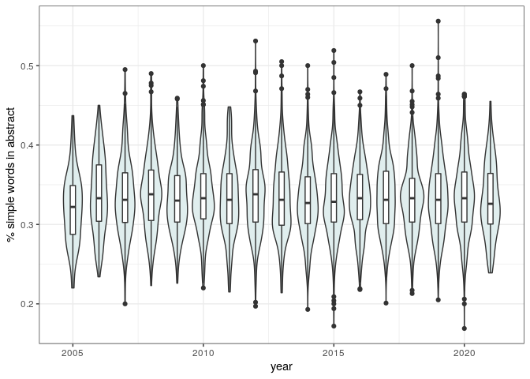

A Skeptic’s Guide to Scientific Writing
================
**Stefano Allesina**
QuEST Workshop, U. Vermont, Apr 2021

  - [History of the paper](#history-of-the-paper)
  - [Common advice on writing papers](#common-advice-on-writing-papers)
  - [What works for me](#what-works-for-me)
  - [Pet peeves and best practices](#pet-peeves-and-best-practices)
  - [Being a skeptic](#being-a-skeptic)
  - [Have some fun with real data](#have-some-fun-with-real-data)
      - [Notes on data](#notes-on-data)
      - [Taking a peek](#taking-a-peek)
      - [Choose your own adventure](#choose-your-own-adventure)
      - [A Choice of Weapons](#a-choice-of-weapons)
  - [Homework](#homework)

# History of the paper

The way of publishing research has been evolving over the past few
centuries:

  - First journal in 1665 *Philosophical Transactions of the Royal
    Society*; rudimentary editorial review; initially, many short
    articles describing oddities and events ([*Of the way of killing
    ratle-snakes, used in
    Virginia*](https://royalsocietypublishing.org/doi/10.1098/rstl.1665.0022),
    [*An observation imparted to the noble Mr Boyle, by Mr David Thomas,
    touching some particulars further considerable in the monster
    mentioned in the first papers of these philosophical
    transactions*](https://royalsocietypublishing.org/doi/10.1098/rstl.1665.0015)
    ).
  - From 1753 papers for *PTRS* were read by a fellow at a Society
    meeting, and considered by a Committee on Papers: *“There were four
    possible verdicts: a paper might be printed, rejected, consideration
    of it deferred to a future meeting, or referred to someone more
    expert – in which case the Committee could call upon an ordinary
    member of the Society, who would sit in on the relevant meeting and
    vote not just on the specific paper he’d been called to give an
    opinion on but on all papers considered at that meeting. (This was
    not very widely applied, but it is the first instance of provision
    for peer review being written into the statutes of the Society).”*
    (from
    [here](https://royalsociety.org/blog/2015/03/philosophical-transactions-the-early-years/)).
  - Books continued to dominate until 19th century, with physical
    sciences transitioning to journal-dominated.
  - External, anyonymous reviews started sometimes in the 19th century,
    but became customary much later.
  - Einstein, who had submitted to *Physical Reviews* in 1935: *“We
    (Mr. Rosen and I) had sent you our manuscript for publication and
    had not authorised you to show it to specialists before it is
    printed. I see no reason to address the – in any case erroneous –
    comments of your anonymous expert. On the basis of this incident I
    prefer to publish the paper elsewhere.”*
  - Right now: Editor (or Deputies) sift through submissions; assign to
    a specialist editor (typically, member of the Editorial Board) who
    select 2-4 reviewers. Outcomes: accept, minor revisions, major
    revisions, reject (with or without prejudice).
  - Some special cases: Watson and Crick paper on the structure of DNA
    [was not reviewed](https://www.nature.com/articles/426119b.pdf)
    before publication.
  - Open access, published reviews, accompanying code and data,
    registered experiments, reproducible papers are contemporary
    inventions.

# Common advice on writing papers

The advice given to scientific writers follows closely that given to
journalists:

  - keep it short
  - keep it simple
  - who/what/where/when (also, how\!)
  - write for your audience
  - write to be understood

Advice on how to write from Boyle, who was the main proponent of
scientific communication based on short essays (rather than books): *a
Philosopher need not be sollicitous that his style should delight its
Reader with his Floridnesse, yet I think he may very well be allow’d to
take a Care that it disgust not his Reader by its Flatness, especially
when he does not so much deliver Experiments or explicate them, as make
Reflections or Discourses on them; for on such Occasions he may be
allow’d the liberty of recreating his Reader and himself, and
manifesting that he declin’d the Ornaments of Language, not out of
Necessity, but Discretion, which forbids them to be us’d where they may
darken as well as adorn the Subject they are appli’d to.*

Just looking at “10 simple rules” PLoS CB:

  - Bourne, 2005, [Ten Simple Rules for Getting
    Published](https://journals.plos.org/ploscompbiol/article?id=10.1371/journal.pcbi.0010057)
  - Zhang, 2014, [Ten Simple Rules for Writing Research
    Papers](https://journals.plos.org/ploscompbiol/article?id=10.1371/journal.pcbi.1003453)
  - Mensh & Kording, 2017, [Ten simple rules for structuring
    papers](https://journals.plos.org/ploscompbiol/article?id=10.1371/journal.pcbi.1005619)
  - Penders, 2018, [Ten simple rules for responsible
    referencing](https://journals.plos.org/ploscompbiol/article?id=10.1371/journal.pcbi.1006036)
  - Rougier et al., 2014 [Ten Simple Rules for Better
    Figures](https://journals.plos.org/ploscompbiol/article?id=10.1371/journal.pcbi.1003833)
  - Pautasso, 2013, [Ten Simple Rules for Writing a Literature
    Review](https://journals.plos.org/ploscompbiol/article?id=10.1371/journal.pcbi.1003149)
  - Frassi et al., 2018, [Ten simple rules for collaboratively writing a
    multi-authored
    paper](https://journals.plos.org/ploscompbiol/article?id=10.1371/journal.pcbi.1006508)

# What works for me

  - Writing takes much longer than typing.
  - Work on the structure of the narrarive on a piece of paper; choose a
    few figures and connect the dots; try this with multiple people.
  - Extensively document what you’re doing (`RMarkDown`, `Jupyter
    notebook`, literate programming).
  - Start from the Supplementary information.
  - Writing as “carving” vs. building. *“I saw the angel in the marble
    and carved until I set him free.”* — Michelangelo

# Pet peeves and best practices

Things that I value as a **reviewer**:

  - line numbers, please\!
  - no poetic/enigmatic titles
  - if you are using data, include them
  - if you are using code, include it (and make it
    [readable](https://github.com/StefanoAllesina/R3CR/tree/master/lecture_1))
  - if you are using interesting/novel techniques, be pedagogical (at
    least in SI)
  - cite relevant work
  - put care in preparing figures/text

Things that I value as an **editor**:

  - clearly state the problem you want to solve
  - it is better if the problem existed before you solved it
  - make a clear case for the choice of journal
  - do not overstate relevance/novelty
  - include suggestions for handling/academic editors and reviewers

# Being a skeptic

Weinberger, Evans & Allesina, 2015, [Ten Simple (Empirical) Rules for
Writing
Science](https://journals.plos.org/ploscompbiol/article?id=10.1371/journal.pcbi.1004205)

Is the advice given to scientist good?

  - Take 1M abstracts from a variety of disciplines
  - Take citations as a proxy for readership
  - Measure features (e.g., length, active vs. passive, how many words
    are “simple”)
  - Use z-scores (to account for differences in journals)
  - Build a linear model to account for year of publication, journal,
    discipline, number of authors, paper length
  - Do features improve number of citations?

<p align="center">


</p>

# Have some fun with real data

The file `data/plos_compbio.csv` contains data on all the documents
published in PLoS Computational Biology (as of 3/3/2021). The file is
comma-separated, with headers specifying the content of each column:

  - `DOI` the Digital Object Identifier for the document
  - `title` the title of the document
  - `year` the publication year
  - `num_citations` number of citations received (Scopus data)
  - `num_views` number of views for the html version of the document
  - `document_type` type of document (see below)
  - `num_authors` number of authors
  - `num_references` number of references cited in the document
  - `num_figures` number of figures in the document
  - `num_equations` obtained counting special math formatting in XML
    source of the document
  - `num_countries` number of distinct countries in affiliation list
  - `num_words_title` number of words in the title
  - `num_words_abstract` number of words in the abstract
  - `prop_words_abs` proportion of distinct words in the abstract that
    are found in a list of words used for spell-checking (\~0.5M words)
  - `prop_simple_words_abs` proportion of distinct words in the abstract
    that are found in a list of words used in simplified English (\~2K
    words)
  - `first_au_F` probability that first author is a woman (see below)
  - `last_au_F` probability that last (senior) author is a woman (see
    below)

The file `data/plos_compbio_details.csv` contains:

  - `DOI` the Digital Object Identifier for the document
  - `abstract` the full text of the abstract (for documents with an
    abstract)
  - `countries` the list of countries represented in the affiliation
    list
  - `subjects` a list of (self-reported) subjects
  - `reference_years` the years in which the cited references were cited

## Notes on data

Obligatory disclaimer: data are never perfect.

Missing data (e.g., for documents without abstract) is reported as `NA`.

You can read a document by opening
`https://journals.plos.org/ploscompbiol/article?id=YOUR_DOI_HERE` for
example
<https://journals.plos.org/ploscompbiol/article?id=10.1371/journal.pcbi.1000494>

Types of documents

  - Article: 7173
  - Editorial: 155
  - Erratum: 150
  - Review: 149
  - Short Survey: 15
  - Letter: 14
  - Note: 13
  - Conference Paper: 6

Assignment of gender is based on first name. The reported probability is
computed by counting the number of newborns that were assigned at birth
a certain name and sex combination (as of today, SSA reports only
male/female). The data, provided by the Social Security Administration,
covers US newborns from about 1880 to today. Clearly, the assignment is
going to be most accurate for authors residing in English-speaking
countries, though the large immigrant population in the US allows some
resolution of names that originated in other areas of the world.

## Taking a peek

This rich data set allows us to explore several aspects of scientific
writing. Just a few basic visualizations:

``` r
# the code for the visualizations below is here
source("../data_viz/simple_visualizations.R")
```

Distribution of citations:

``` r
pl_cit1
```


Note the very broad, skewed distribution. To model citations, is
therefore convenient to transform the data. In particular, plotting
`log(num_citations + 1)`, we obtain:

``` r
pl_cit2
```


Note the many documents with zero citations—these are mostly editorials,
errata, etc. Considering only `Article`, we find Gaussian-looking
distributions (note that 2020 and 2021 are excluded):

``` r
pl_cit3
```


Similarly, the number of views is highly skewed:

``` r
pl_view1
```


and the transformation has a similar effect

``` r
pl_view3
```


The typical number of authors per document increased slightly over the
years:

``` r
pl_au
```


And the proportion of articles authored by women about doubled over 15
years:

``` r
pl_gender
```


International collaborations became more frequent:

``` r
pl_countries
```


The number of words in the abstract has remained about constant:

``` r
pl_abs_len
```


The proportion of simple words in the abstract has also remained quite
constant:

``` r
pl_simple_words
```



The number of references and figures has been constant as well:

``` r
pl_num_refs
```


``` r
pl_num_figs
```


While the proportion of articles containing several equations has been
raising steadily:

``` r
pl_num_eqn
```


## Choose your own adventure

  - **Effect of shorter titles** (based on Letchford *et al.* [“The
    advantage of short paper
    titles”](https://royalsocietypublishing.org/doi/full/10.1098/rsos.150266)
    Royal Society open science 2015)

  - **Effect of equations** (based on Fawcett and Higginson [“Heavy use
    of equations impedes communication among
    biologists”](https://www.pnas.org/content/109/29/11735) PNAS 2012)

  - **Effect of figures** (based on Lee *et al.* [“Viziometrics:
    Analyzing visual information in the scientific
    literature.”](https://ieeexplore.ieee.org/abstract/document/7888968)
    IEEE 2017)

  - **International collaborations** (based on Smith *et al.* [“The
    scientific impact of nations: Journal placement and citation
    performance”](https://journals.plos.org/plosone/article?id=10.1371/journal.pone.0109195)
    PLoS ONE 2014)

  - **Your question here** (maybe inspired by Tahamtan *et al.*
    [“Factors affecting number of citations: a comprehensive review of
    the
    literature”](https://link.springer.com/content/pdf/10.1007/s11192-016-1889-2.pdf)
    Scientometrics 2016)

## A Choice of Weapons

### Rank-correlation

Does a certain feature correlate (in a qualitative/ranking sense,
e.g. Kendall’s) with citations/view?

  - **Pros:** easy, quick to compute, easy to interpret, works well for
    highly skewed distributions (such as citations/views).
  - **Cons:** difficult to control for factors influencing the response
    (e.g., number of authors, year of publication); one possibilty is to
    split the data into classes and run it by class.

### Generalized Linear Models

Take \(y_i\) to be the (possibly, log-transformed) number of citations
(or views) for article \(i\). We can model this “response variable” as a
linear combination of the predictors, and an error term. Examples (in
`R`):

`log(num_citations + 1) ~ year` (assumes that citations increase at a
constant rate by year)

`log(num_citations + 1) ~ as.factor(year) + num_authors` (fit each year
independently, assumes citations change in an orderly exponential
\[i.e., the log is linear\] way with the number of authors; you might
want to bin the number of authors and use it as a factor)

The model can be made as complex as needed.

  - **Pros:** well-studied, quick to compute, excellent diagnostics.
  - **Cons:** need careful transformation of responses; model selection
    to choose among several competing models; changes in order and
    detailed implementation of predictors can change result.

### Randomizations

Say that we want to probe whether papers with a female first-author
accrue more citations than those with a male first-author. Then we can
compute the average (or median, etc.) number of citations for papers
with a female first author. Call this the *observed* average. Then, we
can re-compute the value after shuffling the imputed sex of the first
author in the data. By repeatedly shuffling and measuring, we create a
distribution of the *expected* average number of citations. If the
observed value lies in the tails of the distribution (e.g., measure a
p-value), we conclude that the effect of having a female first-author is
significant.

  - **Pros:** very robust, easy to understand and implement.
  - **Cons:** computationally intensive; it is easier to test for binary
    predictors.

# Homework

Analyze the provided data, guided by an hypothesis on what would make
for an impactful paper. If you share an `Rmd` file with me, I can
publish it on the website for next week.
